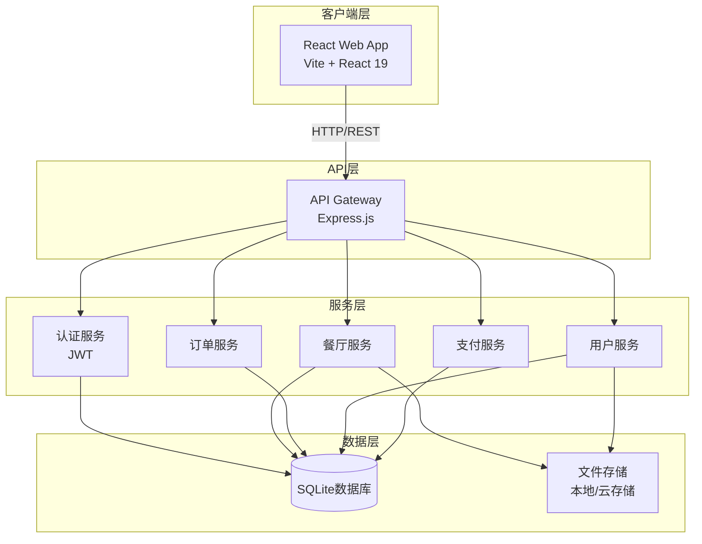
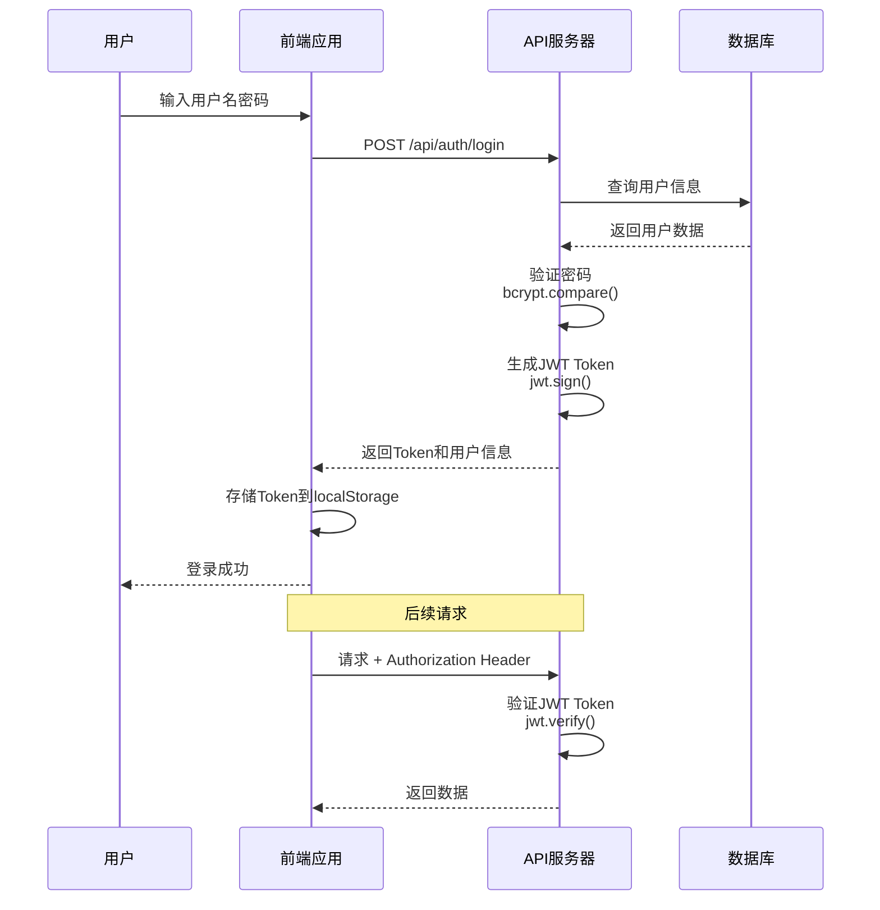
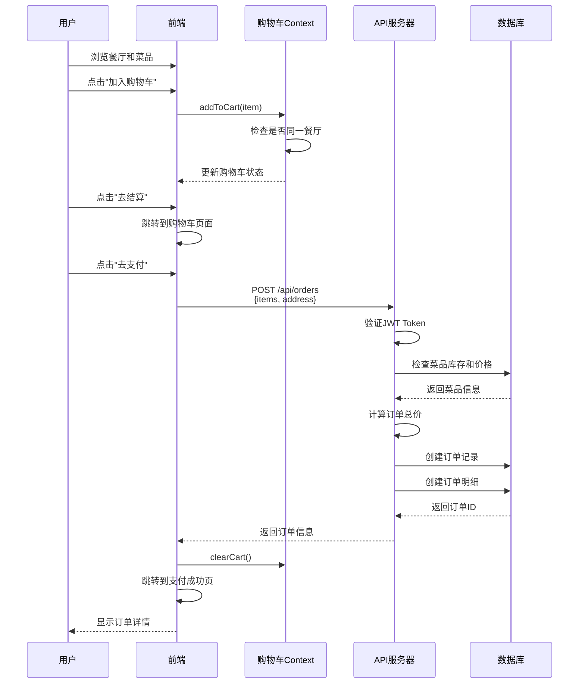
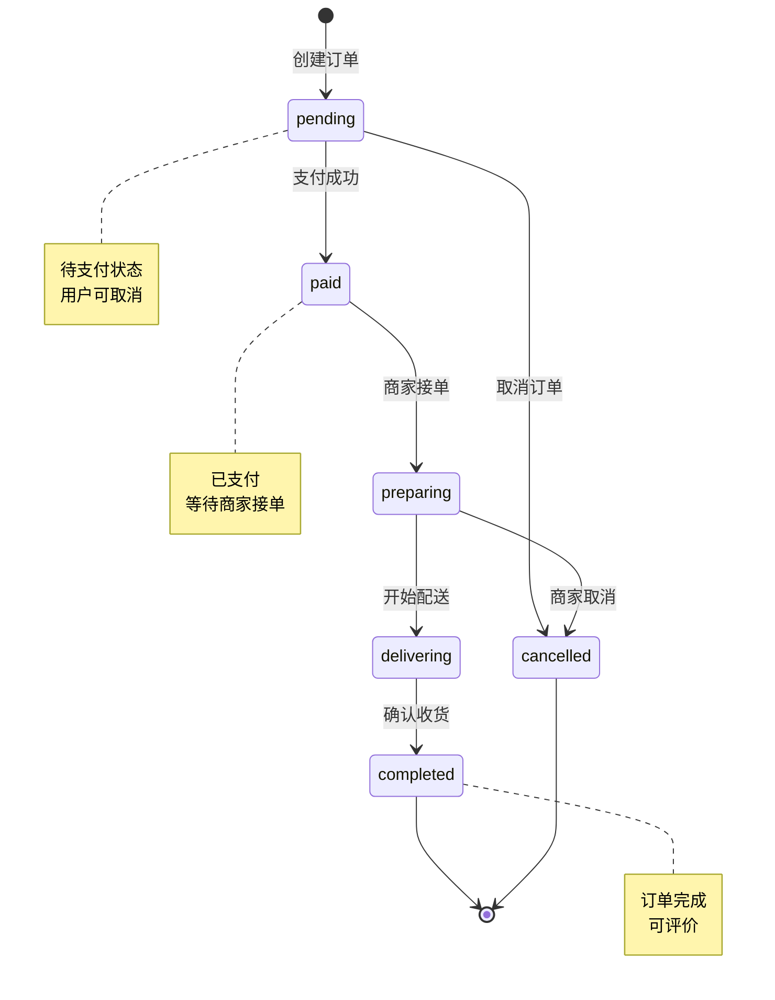

# 饭否（Fanfou）校园外卖系统 - 前后端架构设计文档

## 文档概述

本文档描述了饭否校园外卖系统从纯前端应用向完整前后端分离架构的设计方案。

**文档版本**: 1.0  
**创建日期**: 2026-02-25  
**项目类型**: 校园外卖/订餐应用

---

## 目录

- [1. 项目背景](#1-项目背景)
- [2. 系统架构](#2-系统架构)
- [3. 技术栈选型](#3-技术栈选型)
- [4. 目录结构](#4-目录结构)
- [5. 数据库设计](#5-数据库设计)
- [6. API 接口设计](#6-api-接口设计)
- [7. 认证与授权](#7-认证与授权)
- [8. 核心业务流程](#8-核心业务流程)
- [9. 部署方案](#9-部署方案)
- [10. 开发指南](#10-开发指南)

---

## 1. 项目背景

### 1.1 项目简介

饭否（Fanfou）是一个面向校园用户的外卖订餐应用，提供餐厅浏览、菜品搜索、在线下单、订单管理等功能。

### 1.2 当前状态

目前项目是**纯前端实现**，使用 mock 数据模拟后端接口，主要功能包括：

- ✅ 浏览餐厅/商家列表
- ✅ 搜索餐厅和菜品
- ✅ 查看餐厅详情和菜单
- ✅ 购物车管理（前端状态）
- ✅ 订单创建和历史查看（mock数据）
- ✅ 个人中心页面

**现有技术栈**: React 19 + TypeScript + Vite + TailwindCSS + React Router

### 1.3 改造目标

将项目改造为完整的前后端分离系统：

- 🎯 搭建独立的后端 API 服务器
- 🎯 设计并实现数据库结构
- 🎯 实现用户认证与授权机制
- 🎯 前端对接真实 API 接口
- 🎯 支持生产环境部署

---

## 2. 系统架构

### 2.1 整体架构图

采用**前后端完全分离**的架构模式，前端通过 RESTful API 与后端通信：



### 2.2 架构层次说明

#### 客户端层（Client Layer）
- **React Web App**: 使用 React 19 + TypeScript 构建的单页应用（SPA）
- **职责**: 用户界面渲染、用户交互处理、前端路由管理、API 请求封装

#### API 层（API Layer）
- **API Gateway**: 基于 Express.js 的 RESTful API 服务器
- **职责**: 请求路由、参数验证、错误处理、响应格式化

#### 服务层（Service Layer）
- **认证服务**: 用户注册、登录、JWT token 管理
- **餐厅服务**: 餐厅列表、详情、菜单管理
- **订单服务**: 订单创建、查询、状态更新
- **用户服务**: 用户信息管理、地址管理
- **支付服务**: 支付接口对接（未来扩展）

#### 数据层（Data Layer）
- **SQLite 数据库**: 关系型数据持久化
- **文件存储**: 图片、附件等静态资源存储

### 2.3 通信协议

- **协议**: HTTP/HTTPS
- **数据格式**: JSON
- **认证方式**: JWT Bearer Token

---

## 3. 技术栈选型

### 3.1 前端技术栈（已有）

| 技术 | 版本 | 用途 |
|------|------|------|
| React | 19.0.0 | UI 框架 |
| TypeScript | 5.8.2 | 类型系统 |
| Vite | 6.2.0 | 构建工具 |
| React Router | 7.13.1 | 前端路由 |
| TailwindCSS | 4.1.14 | CSS 框架 |
| Lucide React | 0.546.0 | 图标库 |

### 3.2 后端技术栈（新增）

| 技术 | 版本 | 用途 |
|------|------|------|
| Node.js | 18+ | 运行时环境 |
| Express.js | 4.21.2 | Web 框架 |
| TypeScript | 5.8.2 | 类型系统 |
| better-sqlite3 | 12.4.1 | SQLite 数据库 |
| jsonwebtoken | ^9.0.2 | JWT 认证 |
| bcrypt | ^5.1.1 | 密码加密 |
| express-validator | ^7.0.1 | 参数验证 |
| cors | ^2.8.5 | 跨域处理 |
| dotenv | 17.2.3 | 环境变量 |

### 3.3 开发工具

| 工具 | 用途 |
|------|------|
| tsx | TypeScript 执行器 |
| nodemon | 开发热重载 |
| concurrently | 并行运行脚本 |
| ESLint | 代码检查 |
| Prettier | 代码格式化 |

### 3.4 技术选型理由

**为什么选择 Express.js？**
- 成熟稳定，社区活跃
- 中间件生态丰富
- 与前端技术栈（Node.js/TypeScript）统一
- 易于学习和维护

**为什么选择 SQLite？**
- 零配置，无需独立数据库服务
- 适合中小规模应用
- 文件型数据库，便于开发和部署
- 后期可平滑迁移到 PostgreSQL/MySQL

**为什么选择 JWT？**
- 无状态认证，易于扩展
- 跨域友好
- 支持移动端
- 标准化协议

---

## 4. 目录结构

### 4.1 完整目录树

```
fanfou/
├── client/                    # 前端代码（现有 src/ 移动至此）
│   ├── src/
│   │   ├── api/              # API 调用封装
│   │   │   ├── client.ts     # Axios 实例配置
│   │   │   ├── auth.ts       # 认证 API
│   │   │   ├── restaurants.ts # 餐厅 API
│   │   │   ├── orders.ts     # 订单 API
│   │   │   └── users.ts      # 用户 API
│   │   ├── components/       # UI 组件
│   │   │   ├── BottomNav.tsx
│   │   │   └── RestaurantCard.tsx
│   │   ├── context/          # Context 状态
│   │   │   └── CartContext.tsx
│   │   ├── hooks/            # 自定义 Hooks
│   │   │   ├── useAuth.ts
│   │   │   └── useApi.ts
│   │   ├── pages/            # 页面组件
│   │   │   ├── Home.tsx
│   │   │   ├── RestaurantDetail.tsx
│   │   │   ├── Cart.tsx
│   │   │   ├── Orders.tsx
│   │   │   ├── Profile.tsx
│   │   │   └── CheckoutSuccess.tsx
│   │   ├── types/            # TypeScript 类型
│   │   │   └── index.ts
│   │   ├── utils/            # 工具函数
│   │   │   └── utils.ts
│   │   ├── App.tsx
│   │   └── main.tsx
│   ├── public/
│   ├── index.html
│   ├── package.json
│   ├── tsconfig.json
│   └── vite.config.ts
│
├── server/                    # 后端代码（新增）
│   ├── src/
│   │   ├── config/           # 配置文件
│   │   │   ├── database.ts   # 数据库配置
│   │   │   └── env.ts        # 环境变量
│   │   ├── controllers/      # 控制器
│   │   │   ├── auth.controller.ts
│   │   │   ├── restaurant.controller.ts
│   │   │   ├── order.controller.ts
│   │   │   └── user.controller.ts
│   │   ├── models/           # 数据模型
│   │   │   ├── User.ts
│   │   │   ├── Restaurant.ts
│   │   │   ├── Order.ts
│   │   │   └── MenuItem.ts
│   │   ├── routes/           # 路由定义
│   │   │   ├── auth.routes.ts
│   │   │   ├── restaurant.routes.ts
│   │   │   ├── order.routes.ts
│   │   │   ├── user.routes.ts
│   │   │   └── index.ts
│   │   ├── services/         # 业务逻辑
│   │   │   ├── auth.service.ts
│   │   │   ├── restaurant.service.ts
│   │   │   ├── order.service.ts
│   │   │   └── user.service.ts
│   │   ├── middleware/       # 中间件
│   │   │   ├── auth.middleware.ts
│   │   │   ├── validation.middleware.ts
│   │   │   └── error.middleware.ts
│   │   ├── utils/            # 工具函数
│   │   │   ├── jwt.ts
│   │   │   └── logger.ts
│   │   ├── types/            # TypeScript 类型
│   │   │   └── index.ts
│   │   └── index.ts          # 入口文件
│   ├── database/
│   │   ├── schema.sql        # 数据库表结构
│   │   ├── seed.sql          # 初始数据
│   │   └── fanfou.db         # SQLite 数据库文件（生成）
│   ├── uploads/              # 文件上传目录
│   ├── package.json
│   ├── tsconfig.json
│   └── .env.example
│
├── shared/                    # 前后端共享代码
│   └── types/                # 共享类型定义
│       ├── User.ts
│       ├── Restaurant.ts
│       ├── Order.ts
│       └── ApiResponse.ts
│
├── docs/                      # 文档
│   ├── architecture.md       # 本文档
│   ├── api.md                # API 接口文档
│   └── deployment.md         # 部署文档
│
├── .gitignore
└── README.md
```

### 4.2 关键目录说明

#### `/client` - 前端目录
- `src/api/`: 封装所有后端 API 调用
- `src/hooks/`: 自定义 React Hooks（如 useAuth）
- `src/types/`: 前端特定的 TypeScript 类型定义

#### `/server` - 后端目录
- `src/controllers/`: 处理 HTTP 请求，调用 service 层
- `src/services/`: 业务逻辑层，处理复杂业务
- `src/models/`: 数据模型，与数据库表对应
- `src/middleware/`: Express 中间件（认证、验证、错误处理）

#### `/shared` - 共享代码
- 前后端共享的 TypeScript 类型定义
- 避免类型定义重复
- 确保前后端类型一致性

---

## 5. 数据库设计

### 5.1 ER 图


### 5.2 数据表详细设计

#### 5.2.1 users（用户表）

| 字段 | 类型 | 约束 | 说明 |
|------|------|------|------|
| id | INTEGER | PRIMARY KEY | 用户ID |
| username | VARCHAR(50) | UNIQUE, NOT NULL | 用户名 |
| email | VARCHAR(100) | UNIQUE, NOT NULL | 邮箱 |
| password_hash | VARCHAR(255) | NOT NULL | 密码哈希 |
| phone | VARCHAR(20) | | 手机号 |
| avatar | VARCHAR(255) | | 头像URL |
| created_at | DATETIME | DEFAULT CURRENT_TIMESTAMP | 创建时间 |
| updated_at | DATETIME | DEFAULT CURRENT_TIMESTAMP | 更新时间 |

**索引**:
- `idx_username` ON username
- `idx_email` ON email

#### 5.2.2 restaurants（餐厅表）

| 字段 | 类型 | 约束 | 说明 |
|------|------|------|------|
| id | INTEGER | PRIMARY KEY | 餐厅ID |
| name | VARCHAR(100) | NOT NULL | 餐厅名称 |
| description | TEXT | | 餐厅描述 |
| image | VARCHAR(255) | | 封面图片 |
| rating | DECIMAL(2,1) | DEFAULT 0.0 | 评分 |
| delivery_time | VARCHAR(50) | | 配送时间（如"20-30分钟"） |
| delivery_fee | DECIMAL(10,2) | DEFAULT 0.00 | 配送费 |
| min_order | DECIMAL(10,2) | DEFAULT 0.00 | 起送价 |
| status | VARCHAR(20) | DEFAULT 'active' | 状态：active/inactive |
| created_at | DATETIME | DEFAULT CURRENT_TIMESTAMP | 创建时间 |

#### 5.2.3 categories（分类表）

| 字段 | 类型 | 约束 | 说明 |
|------|------|------|------|
| id | INTEGER | PRIMARY KEY | 分类ID |
| restaurant_id | INTEGER | FOREIGN KEY | 所属餐厅ID |
| name | VARCHAR(50) | NOT NULL | 分类名称 |
| sort_order | INTEGER | DEFAULT 0 | 排序顺序 |

#### 5.2.4 menu_items（菜品表）

| 字段 | 类型 | 约束 | 说明 |
|------|------|------|------|
| id | INTEGER | PRIMARY KEY | 菜品ID |
| restaurant_id | INTEGER | FOREIGN KEY | 所属餐厅ID |
| category_id | INTEGER | FOREIGN KEY | 所属分类ID |
| name | VARCHAR(100) | NOT NULL | 菜品名称 |
| description | TEXT | | 菜品描述 |
| price | DECIMAL(10,2) | NOT NULL | 价格 |
| image | VARCHAR(255) | | 图片URL |
| status | VARCHAR(20) | DEFAULT 'available' | 状态：available/sold_out |
| created_at | DATETIME | DEFAULT CURRENT_TIMESTAMP | 创建时间 |

**索引**:
- `idx_restaurant_id` ON restaurant_id
- `idx_category_id` ON category_id

#### 5.2.5 orders（订单表）

| 字段 | 类型 | 约束 | 说明 |
|------|------|------|------|
| id | INTEGER | PRIMARY KEY | 订单ID |
| user_id | INTEGER | FOREIGN KEY | 用户ID |
| restaurant_id | INTEGER | FOREIGN KEY | 餐厅ID |
| status | VARCHAR(20) | DEFAULT 'pending' | 订单状态 |
| total_price | DECIMAL(10,2) | NOT NULL | 总价 |
| delivery_fee | DECIMAL(10,2) | DEFAULT 0.00 | 配送费 |
| delivery_address | TEXT | NOT NULL | 配送地址 |
| notes | TEXT | | 备注 |
| created_at | DATETIME | DEFAULT CURRENT_TIMESTAMP | 创建时间 |
| updated_at | DATETIME | DEFAULT CURRENT_TIMESTAMP | 更新时间 |

**订单状态枚举**:
- `pending`: 待支付
- `paid`: 已支付
- `preparing`: 商家准备中
- `delivering`: 配送中
- `completed`: 已完成
- `cancelled`: 已取消

**索引**:
- `idx_user_id` ON user_id
- `idx_status` ON status

#### 5.2.6 order_items（订单明细表）

| 字段 | 类型 | 约束 | 说明 |
|------|------|------|------|
| id | INTEGER | PRIMARY KEY | 明细ID |
| order_id | INTEGER | FOREIGN KEY | 订单ID |
| menu_item_id | INTEGER | FOREIGN KEY | 菜品ID |
| quantity | INTEGER | NOT NULL | 数量 |
| price | DECIMAL(10,2) | NOT NULL | 单价（快照） |

#### 5.2.7 addresses（地址表）

| 字段 | 类型 | 约束 | 说明 |
|------|------|------|------|
| id | INTEGER | PRIMARY KEY | 地址ID |
| user_id | INTEGER | FOREIGN KEY | 用户ID |
| name | VARCHAR(50) | NOT NULL | 联系人姓名 |
| phone | VARCHAR(20) | NOT NULL | 联系电话 |
| address | VARCHAR(255) | NOT NULL | 地址 |
| detail | VARCHAR(255) | | 详细地址（门牌号等） |
| is_default | BOOLEAN | DEFAULT 0 | 是否默认地址 |
| created_at | DATETIME | DEFAULT CURRENT_TIMESTAMP | 创建时间 |

---

## 6. API 接口设计

### 6.1 接口规范

#### 6.1.1 请求格式

**Base URL**: `http://localhost:4000/api`

**请求头**:
```
Content-Type: application/json
Authorization: Bearer {token}  # 需要认证的接口
```

#### 6.1.2 响应格式

**成功响应**:
```json
{
  "success": true,
  "data": { ... },
  "message": "操作成功"
}
```

**错误响应**:
```json
{
  "success": false,
  "error": {
    "code": "ERROR_CODE",
    "message": "错误描述"
  }
}
```

#### 6.1.3 HTTP 状态码

| 状态码 | 说明 |
|--------|------|
| 200 | 成功 |
| 201 | 创建成功 |
| 400 | 请求参数错误 |
| 401 | 未认证 |
| 403 | 无权限 |
| 404 | 资源不存在 |
| 500 | 服务器错误 |

### 6.2 认证接口

#### POST /api/auth/register
用户注册

**请求体**:
```json
{
  "username": "zhangsan",
  "email": "zhangsan@example.com",
  "password": "password123",
  "phone": "13800138000"
}
```

**响应**:
```json
{
  "success": true,
  "data": {
    "token": "eyJhbGciOiJIUzI1NiIsInR5cCI6IkpXVCJ9...",
    "user": {
      "id": 1,
      "username": "zhangsan",
      "email": "zhangsan@example.com"
    }
  }
}
```

#### POST /api/auth/login
用户登录

**请求体**:
```json
{
  "email": "zhangsan@example.com",
  "password": "password123"
}
```

**响应**: 同注册接口

#### GET /api/auth/profile
获取当前用户信息（需认证）

**响应**:
```json
{
  "success": true,
  "data": {
    "id": 1,
    "username": "zhangsan",
    "email": "zhangsan@example.com",
    "phone": "13800138000",
    "avatar": "https://..."
  }
}
```

### 6.3 餐厅接口

#### GET /api/restaurants
获取餐厅列表

**查询参数**:
- `search`: 搜索关键词（可选）
- `page`: 页码（默认1）
- `limit`: 每页数量（默认20）

**响应**:
```json
{
  "success": true,
  "data": {
    "restaurants": [
      {
        "id": 1,
        "name": "一食堂 - 川湘风味",
        "rating": 4.8,
        "deliveryTime": "20-30分钟",
        "deliveryFee": 0,
        "minOrder": 10.00,
        "image": "https://...",
        "tags": ["川菜", "湘菜"]
      }
    ],
    "total": 10,
    "page": 1,
    "totalPages": 1
  }
}
```

#### GET /api/restaurants/:id
获取餐厅详情

**响应**:
```json
{
  "success": true,
  "data": {
    "id": 1,
    "name": "一食堂 - 川湘风味",
    "description": "正宗川湘风味",
    "rating": 4.8,
    "deliveryTime": "20-30分钟",
    "deliveryFee": 0,
    "minOrder": 10.00,
    "image": "https://...",
    "categories": [
      {
        "id": 1,
        "name": "热销"
      }
    ]
  }
}
```

#### GET /api/restaurants/:id/menu
获取餐厅菜单

**响应**:
```json
{
  "success": true,
  "data": {
    "categories": [
      {
        "id": 1,
        "name": "热销",
        "items": [
          {
            "id": 1,
            "name": "宫保鸡丁盖饭",
            "description": "经典川菜",
            "price": 15.00,
            "image": "https://...",
            "status": "available"
          }
        ]
      }
    ]
  }
}
```

### 6.4 订单接口

#### POST /api/orders
创建订单（需认证）

**请求体**:
```json
{
  "restaurantId": 1,
  "items": [
    {
      "menuItemId": 1,
      "quantity": 2
    }
  ],
  "deliveryAddressId": 1,
  "notes": "不要辣椒"
}
```

**响应**:
```json
{
  "success": true,
  "data": {
    "orderId": 123,
    "status": "pending",
    "totalPrice": 35.00
  }
}
```

#### GET /api/orders
获取用户订单列表（需认证）

**查询参数**:
- `status`: 订单状态（可选）
- `page`: 页码
- `limit`: 每页数量

**响应**:
```json
{
  "success": true,
  "data": {
    "orders": [
      {
        "id": 123,
        "restaurant": {
          "id": 1,
          "name": "一食堂"
        },
        "status": "completed",
        "totalPrice": 35.00,
        "createdAt": "2026-02-25T10:30:00Z"
      }
    ],
    "total": 5,
    "page": 1
  }
}
```

#### GET /api/orders/:id
获取订单详情（需认证）

**响应**:
```json
{
  "success": true,
  "data": {
    "id": 123,
    "restaurant": {
      "id": 1,
      "name": "一食堂"
    },
    "items": [
      {
        "name": "宫保鸡丁盖饭",
        "quantity": 2,
        "price": 15.00
      }
    ],
    "status": "completed",
    "totalPrice": 35.00,
    "deliveryAddress": "学生公寓A栋101",
    "createdAt": "2026-02-25T10:30:00Z"
  }
}
```

#### PUT /api/orders/:id/cancel
取消订单（需认证）

**响应**:
```json
{
  "success": true,
  "message": "订单已取消"
}
```

### 6.5 用户接口

#### GET /api/users/profile
获取个人信息（需认证）

同 `/api/auth/profile`

#### PUT /api/users/profile
更新个人信息（需认证）

**请求体**:
```json
{
  "username": "newname",
  "phone": "13900139000",
  "avatar": "https://..."
}
```

#### GET /api/users/addresses
获取地址列表（需认证）

**响应**:
```json
{
  "success": true,
  "data": [
    {
      "id": 1,
      "name": "张三",
      "phone": "13800138000",
      "address": "学生公寓A栋101",
      "detail": "",
      "isDefault": true
    }
  ]
}
```

#### POST /api/users/addresses
添加地址（需认证）

**请求体**:
```json
{
  "name": "张三",
  "phone": "13800138000",
  "address": "学生公寓A栋101",
  "detail": "",
  "isDefault": true
}
```

#### PUT /api/users/addresses/:id
更新地址（需认证）

#### DELETE /api/users/addresses/:id
删除地址（需认证）

---

## 7. 认证与授权

### 7.1 JWT 认证流程



### 7.2 Token 结构

**JWT Payload**:
```json
{
  "userId": 1,
  "username": "zhangsan",
  "email": "zhangsan@example.com",
  "iat": 1708876800,
  "exp": 1709481600
}
```

**有效期**: 7天

### 7.3 前端 Token 管理

**存储**: `localStorage.setItem('token', token)`

**使用**:
```typescript
// 在 API 请求中自动添加
axios.interceptors.request.use(config => {
  const token = localStorage.getItem('token');
  if (token) {
    config.headers.Authorization = `Bearer ${token}`;
  }
  return config;
});
```

**刷新**: Token 过期后重新登录

### 7.4 安全措施

- ✅ 密码使用 bcrypt 加密存储
- ✅ JWT 使用强密钥签名
- ✅ HTTPS 传输（生产环境）
- ✅ Token 设置合理过期时间
- ✅ 敏感操作二次验证

---

## 8. 核心业务流程

### 8.1 用户下单流程



### 8.2 订单状态流转



### 8.3 数据同步流程

**Mock 数据迁移**:
1. 从 `src/data/mockData.ts` 提取数据
2. 转换为 SQL INSERT 语句
3. 写入 `server/database/seed.sql`
4. 启动时自动导入数据库

---

## 9. 部署方案

### 9.1 开发环境

**启动命令**:

```bash
# 安装依赖
npm install

# 启动前端（端口 3000）
npm run client:dev

# 启动后端（端口 4000）
npm run server:dev

# 同时启动前后端
npm run dev
```

**环境变量** (`.env.local`):
```env
# 前端
VITE_API_BASE_URL=http://localhost:4000/api

# 后端
PORT=4000
JWT_SECRET=your-secret-key-change-this-in-production
DATABASE_PATH=./server/database/fanfou.db
NODE_ENV=development
```

### 9.2 生产环境部署

#### 前端部署（静态托管）

**选项 1: Vercel**
```bash
cd client
npm run build
vercel --prod
```

**选项 2: Nginx**
```bash
cd client
npm run build
# 将 dist/ 目录部署到 Nginx
```

**Nginx 配置示例**:
```nginx
server {
    listen 80;
    server_name fanfou.example.com;
    root /var/www/fanfou/client/dist;
    
    location / {
        try_files $uri $uri/ /index.html;
    }
    
    location /api {
        proxy_pass http://localhost:4000;
        proxy_http_version 1.1;
        proxy_set_header Upgrade $http_upgrade;
        proxy_set_header Connection 'upgrade';
        proxy_set_header Host $host;
        proxy_cache_bypass $http_upgrade;
    }
}
```

#### 后端部署（Node.js 服务）

**选项 1: PM2**
```bash
cd server
npm install -g pm2
pm2 start src/index.ts --name fanfou-api --interpreter tsx
pm2 save
pm2 startup
```

**选项 2: Docker**
```dockerfile
FROM node:18-alpine
WORKDIR /app
COPY package*.json ./
RUN npm ci --production
COPY . .
EXPOSE 4000
CMD ["npm", "start"]
```

### 9.3 数据库部署

**开发环境**: SQLite 文件数据库

**生产环境选项**:
1. **继续使用 SQLite**: 适合小规模应用
2. **迁移到 PostgreSQL**: 适合中大规模应用
   - 修改连接配置
   - 使用 pg 替代 better-sqlite3
   - 迁移 SQL 语法差异

### 9.4 环境变量配置（生产）

```env
# 后端 .env
NODE_ENV=production
PORT=4000
JWT_SECRET=<强随机字符串>
DATABASE_PATH=/var/lib/fanfou/fanfou.db
CORS_ORIGIN=https://fanfou.example.com

# 前端构建时
VITE_API_BASE_URL=https://api.fanfou.example.com
```

---

## 10. 开发指南

### 10.1 本地开发流程

1. **克隆项目**
   ```bash
   git clone <repository>
   cd fanfou
   ```

2. **安装依赖**
   ```bash
   npm install
   ```

3. **配置环境变量**
   ```bash
   cp .env.example .env.local
   # 编辑 .env.local 填入配置
   ```

4. **初始化数据库**
   ```bash
   npm run db:init
   npm run db:seed
   ```

5. **启动开发服务器**
   ```bash
   npm run dev
   ```

6. **访问应用**
   - 前端: http://localhost:3000
   - API: http://localhost:4000

### 10.2 代码规范

**TypeScript**:
- 使用严格模式 (`strict: true`)
- 所有函数必须有类型注解
- 避免使用 `any` 类型

**文件命名**:
- 组件: PascalCase (`RestaurantCard.tsx`)
- 工具函数: camelCase (`formatDate.ts`)
- 类型定义: PascalCase (`User.ts`)

**Git 提交规范**:
```
feat: 新功能
fix: 修复bug
docs: 文档更新
style: 代码格式
refactor: 重构
test: 测试
chore: 构建/工具链
```

### 10.3 调试技巧

**前端调试**:
- React DevTools
- Redux DevTools（如使用 Redux）
- Network 面板查看 API 请求

**后端调试**:
- 使用 `console.log` 或 logger
- VSCode 断点调试
- Postman 测试 API

### 10.4 常见问题

**Q: CORS 错误**
A: 确保后端已配置 CORS 中间件，允许前端域名

**Q: Token 认证失败**
A: 检查 token 是否正确存储和发送，是否过期

**Q: 数据库连接失败**
A: 检查数据库文件路径，确保有读写权限

---

## 附录

### A. 参考资料

- [Express.js 官方文档](https://expressjs.com/)
- [React 官方文档](https://react.dev/)
- [JWT 规范](https://jwt.io/)
- [REST API 设计指南](https://restfulapi.net/)

### B. 变更日志

| 版本 | 日期 | 变更内容 |
|------|------|----------|
| 1.0 | 2026-02-25 | 初始版本，完成架构设计 |

---

**文档维护**: 请在重大架构变更时更新本文档

**反馈**: 如有疑问或建议，请提交 Issue 或联系开发团队
